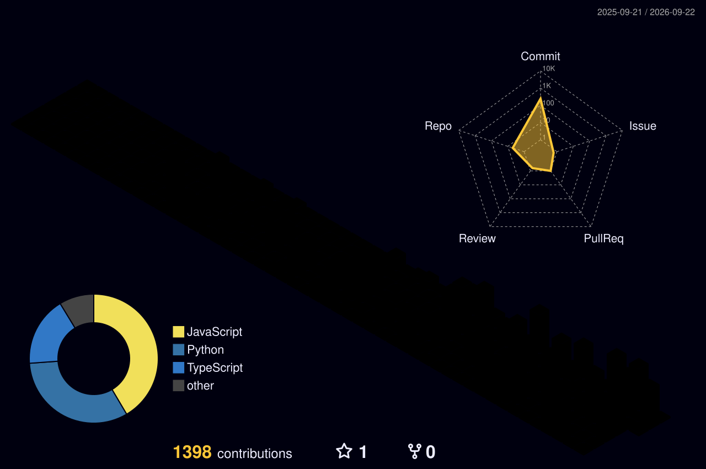

<div align="center">
  

  <!-- Animated Typing Effect -->
  <a href="https://vaishnavieklaspur-portfolio.vercel.app/">
    
  </a>
  
  <!-- Zero-Gap Social & Navigation Hub -->
  <div>
    <a href="https://vaishnavieklaspur-portfolio.vercel.app/"></a>
    <a href="https://linkedin.com/in/vaishnavi-eklaspur"></a>
    <a href="mailto:vaishnavieklaspur3284@gmail.com"></a>
  </div>
</div>

---

## ⚙️ THE ORIGIN: MECHANICAL TO SOFTWARE

> **Most developers design for the happy path. I design for the failure modes.**

My background isn't in standard web development; it's in mechanical engineering. I treat software infrastructure like physical systems—if it can't handle stress, it breaks. I build backends that stay up, data flows that don't bottleneck, and edge-case logic that prevents system collapse. Most of my work lives in the infrastructure details nobody notices, but everybody relies on. 

---

<div align="center">
  <!-- THE CUSTOM UI WIDGET -->
  

  <!-- ZERO-GAP PROJECT ROUTING LINKS -->
  <br/><br/>
  <h3 align="left">🔗 LIVE DEPLOYMENTS & ARCHITECTURE</h3>
  <div align="left">
    <a href="https://credura.duckdns.org/"></a>
    <a href="https://macroshock.streamlit.app"></a>
    <a href="https://duo-challenge-tracker-brown.vercel.app"></a>
    <a href="https://rahi-fawn.vercel.app/"></a>
    <a href="https://smartclinic-web-sigma.vercel.app/"></a>
  </div>
</div>

---

## 🏆 ACHIEVEMENTS UNLOCKED

<table width="100%">
  <tr>
    <td width="50%" valign="top">
      <b>🔧 CLASS CHANGE</b><br/>
      Mechanical engineering → Software. Brought the rigorous, stress-tested failure-mode thinking with me.
    </td>
    <td width="50%" valign="top">
      <b>🐛 BUG SLAYER</b><br/>
      Found and killed a massive 24× over-count in CCTV tracking data that nobody else noticed.
    </td>
  </tr>
  <tr>
    <td width="50%" valign="top">
      <b>📄 PUBLISHED RESEARCH</b><br/>
      IEEE ICEAMST 2025. Architected a blockchain credential verification engine hitting sub-second latency.
    </td>
    <td width="50%" valign="top">
      <b>🗣️ SPRACHE FREIGESCHALTET</b><br/>
      A2 German. Spent 4 years leading MITAOE's Foreign Language Club.
    </td>
  </tr>
</table>

---

## 🎒 INVENTORY & LOADOUT

<div align="center">
  
  <br/>
  
  <br/><br/>
  
  
  
  
</div>

---

## 📊 PLAYER STATS & ARCHITECTURE

<div align="center">
  
  
  <br/><br/>
  <!-- The 3D Contribution Cityscape generated by your GitHub Action -->
  
</div>

---

<details>
<summary><b>🥚 ❯ cat ~/.aliases</b></summary>

```bash
alias ship='git push && echo "es funktioniert"'
alias ganz-sicher='pytest -q && docker compose up --build'
alias nochmal='git reset --hard HEAD~1'   # used more often than I would like
