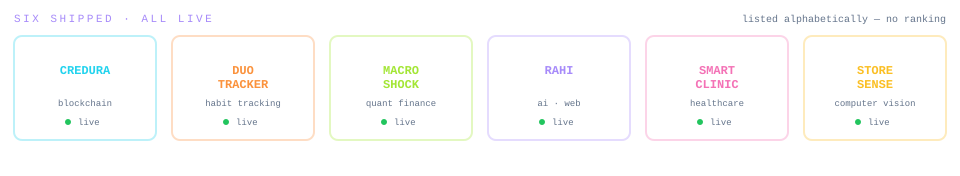

<div align="center">


<!-- Animated Typing Effect -->
<a href="https://vaishnavieklaspur-portfolio.vercel.app/">
  
</a>

<br/>

<a href="https://vaishnavieklaspur-portfolio.vercel.app/"></a>
<a href="https://linkedin.com/in/vaishnavi-eklaspur"></a>
<a href="mailto:vaishnavieklaspur3284@gmail.com"></a>

I build backends that stay up and interfaces that get out of the way. Most of my work lives in the edge cases, the data flows, and the infrastructure details nobody notices but everybody relies on. 

</div>

---

<div align="center">
  
</div>

<br/>

<table>
<tr>
<td width="50%" valign="top">

### 🔗 Credura

<a href="https://credura.duckdns.org/"></a>


Decentralised academic credential verification hitting **sub-second validation latency** on tamper-proof records. Published paper at **IEEE ICEAMST 2025**.
* `Hyperledger Fabric` · `IPFS` · `Docker` · `K8s`
> **💎 THE 10% DECISION:** Put hashes on-chain, but documents on IPFS. Got sub-second validation without paying a ledger to store heavy blobs.

</td>
<td width="50%" valign="top">

### ⛓️ Duo Challenge Tracker

<a href="https://duo-challenge-tracker-brown.vercel.app"></a>
<a href="https://github.com/vaishnavi-eklaspur/Duo-Challenge-Tracker"></a>

A shared habit grid for exactly two people. Serverless Postgres queried straight from the browser with a 16-condition nudge engine writing specific prompts.
* `React 18` · `Vite` · `Neon` · `Tailwind` · `Vercel`
> **💎 THE 10% DECISION:** Zero-step localStorage identity instead of email/password auth. Eliminated onboarding friction so two people *actually* used it.

</td>
</tr>
<tr>
<td width="50%" valign="top">

### 📈 MacroShock

<a href="https://macroshock.streamlit.app"></a>
<a href="https://github.com/vaishnavi-eklaspur/MacroShock"></a>

A multi-asset portfolio risk engine on real 2015–2026 market data. Independently recovered published bond durations from first principles. **79% test coverage.**
* `Python` · `Flask` · `Redis` · `Docker`
> **💎 THE 10% DECISION:** Used a leave-one-crisis-out backtest instead of a random train/test split. Zero data leakage.

</td>
<td width="50%" valign="top">

### 🧭 Rahi

<a href="https://rahi-fawn.vercel.app/"></a>
<a href="https://github.com/vaishnavi-eklaspur/rahi"></a>

An AI career counsellor that measures interests (RIASEC), aptitude, and emotional strengths, matching students to real-world careers.
* `Next.js 16` · `TypeScript` · `Gemini` · `Playwright`
> **💎 THE 10% DECISION:** Grounded the LLM strictly in the user's assessment results. It *cannot* invent or hallucinate a career the test never measured.

</td>
</tr>
<tr>
<td width="50%" valign="top">

### 🏥 Smart Clinic

<a href="https://smartclinic-web-sigma.vercel.app/"></a>


Full-stack healthcare platform with Patient/Doctor/Admin RBAC. Shipped end-to-end: booking, Razorpay integration, PDF invoices, and structured audit logs.
* `Java 17` · `Spring Boot` · `PostgreSQL` · `Flyway`
> **💎 THE 10% DECISION:** Used Flyway migration-driven schema versioning over Hibernate `ddl-auto`. Schema history is now reviewable, reversible, and identical everywhere.

</td>
<td width="50%" valign="top">

### 👁️ StoreSense

<a href="https://storesense-demo.vercel.app/"></a>


Raw CCTV turned into conversion funnels and zone heatmaps across 3+ feeds using YOLO11 + ByteTrack + OpenCLIP. Landed within 20% of hand-verified truth.
* `FastAPI` · `YOLO11` · `OpenCV` · `CI/CD`
> **💎 THE 10% DECISION:** Implemented a 3-frame consensus gate before counting a track. Killed a massive 24× visitor over-count caused by ghost detections.

</td>
</tr>
</table>

> 🔒 *Credura, Smart Clinic and StoreSense are private repos. Code walkthroughs available on request.*

---

## 🎒 INVENTORY & LOADOUT

<div align="center">
  
  <br/>
  
  <br/><br/>
  
  
  
  
  
  
</div>

---

## 🏆 ACHIEVEMENTS UNLOCKED

| | | |
|---|---|---|
| 📄 | **PUBLISHED** | IEEE ICEAMST 2025 — blockchain credential verification |
| 🎮 | **GAME JAM SURVIVOR** | a month in Coventry, UK. Unity 3D prototype. Shipped it, came back. |
| 🗣️ | **SPRACHE FREIGESCHALTET** | A2 German · 4 years leading MITAOE's Foreign Language Club |
| 🔧 | **CLASS CHANGE** | mechanical engineering → software. Kept the failure-mode thinking. |
| 🐛 | **BUG SLAYER** | found and killed a 24× over-count nobody else had noticed |
| 💼 | **FIELD WORK** | interned at Skygge and Coventry University |

---

## 📊 PLAYER STATS

<div align="center">
  
  
  
  
  <br/>
  
  

  *Note: Most of my repos are private, so the public counters undersell it. Ask and I'll walk you through the code.*

</div>

---

<details>
<summary><b>🥚 ❯ cat ~/.aliases</b></summary>

```bash
alias ship='git push && echo "es funktioniert"'
alias ganz-sicher='pytest -q && docker compose up --build'
alias nochmal='git reset --hard HEAD~1'   # used more often than I would like
